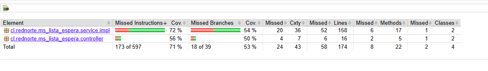

# Pruebas Unitarias — MS-ListaEspera

Documentación de las pruebas unitarias implementadas para el microservicio **MS-ListaEspera**, rama `pruebas-unitarias`.

## Cobertura JaCoCo



| Paquete | Instruccion | Ramas |
|---|---|---|
| `service.impl` | 72% | 54% |
| `controller` | 56% | 50% |
| **Total** | **71%** | **53%** |

***

## Tecnologías utilizadas

- **JUnit 5** — framework de pruebas
- **Mockito** — mocking de dependencias
- **MockMvc** — pruebas de capa HTTP del controller
- **JaCoCo** — reporte de cobertura de código

***

## Estructura de los tests

```
src/test/java/cl/rednorte/ms_lista_espera/
├── controller/
│   └── SolicitudControllerTest.java
└── service/
    └── impl/
        └── SolicitudServiceImplTest.java
```

***

## SolicitudServiceImplTest

Pruebas unitarias para la lógica de negocio del servicio. Usa `@ExtendWith(MockitoExtension.class)` con mocks de todos los repositorios.

### Casos cubiertos

#### `crear()`
| Test | Escenario | Resultado esperado |
|---|---|---|
| `crear_solicitudNormal_debeRetornarResponse` | Request válido, especialidad existe | Retorna `SolicitudResponse` con estado `EN_ESPERA` |
| `crear_especialidadNoExiste_debeArrojarNotFound` | `especialidadId` inexistente | Lanza `ResponseStatusException` 404 |
| `crear_esGES_debeTenerPrioridadUno` | Solicitud con `esGES = true` | Prioridad calculada = 1 |

#### `obtenerDetalle()`
| Test | Escenario | Resultado esperado |
|---|---|---|
| `obtenerDetalle_idExistente_debeRetornarDetalle` | ID válido en base de datos | Retorna `SolicitudDetalleResponse` con datos del paciente |
| `obtenerDetalle_idNoExistente_debeArrojarNotFound` | ID inexistente | Lanza `ResponseStatusException` 404 |

#### `cambiarEstado()`
| Test | Escenario | Resultado esperado |
|---|---|---|
| `cambiarEstado_transicionValidaEnEsperaACitado_debeActualizar` | Transición `EN_ESPERA → CITADO` con fecha futura | Retorna detalle con estado `CITADO` |
| `cambiarEstado_transicionInvalida_debeArrojarBadRequest` | Solicitud `CERRADO → CITADO` | Lanza `ResponseStatusException` 400 |
| `cambiarEstado_anuladoSinMotivo_debeArrojarUnprocessable` | Estado `ANULADO` sin motivo | Lanza `ResponseStatusException` con mensaje de motivo obligatorio |
| `cambiarEstado_citadoConFechaPasada_debeArrojarUnprocessable` | `fechaCita` en el pasado | Lanza `ResponseStatusException` con mensaje de fecha futura |

***

## SolicitudControllerTest

Pruebas unitarias para la capa HTTP del controller. Usa `@WebMvcTest` con `MockMvc` y un `SecurityFilterChain` de test que deshabilita la autenticación JWT.

### Casos cubiertos

| Test | Método HTTP | Endpoint | Resultado esperado |
|---|---|---|---|
| `crear_requestValido_debeRetornar201` | `POST` | `/solicitudes` | HTTP 201 + estado `EN_ESPERA` en JSON |
| `listar_sinFiltros_debeRetornar200` | `GET` | `/solicitudes` | HTTP 200 + página vacía |
| `obtenerDetalle_idExistente_debeRetornar200` | `GET` | `/solicitudes/1` | HTTP 200 + `rutPaciente` en JSON |
| `cambiarEstado_requestValido_debeRetornar200` | `PATCH` | `/solicitudes/1/estado` | HTTP 200 + estado `CITADO` en JSON |

***

## Cómo ejecutar las pruebas

```bash
# Ejecutar todos los tests y generar reporte JaCoCo
./mvnw test

# Ver reporte de cobertura
start target/site/jacoco/index.html   # Windows
open target/site/jacoco/index.html    # Mac/Linux
```

***

## Cómo ejecutar un test específico

```bash
./mvnw test -Dtest="cl.rednorte.ms_lista_espera.service.impl.SolicitudServiceImplTest"
./mvnw test -Dtest="cl.rednorte.ms_lista_espera.controller.SolicitudControllerTest"
```
